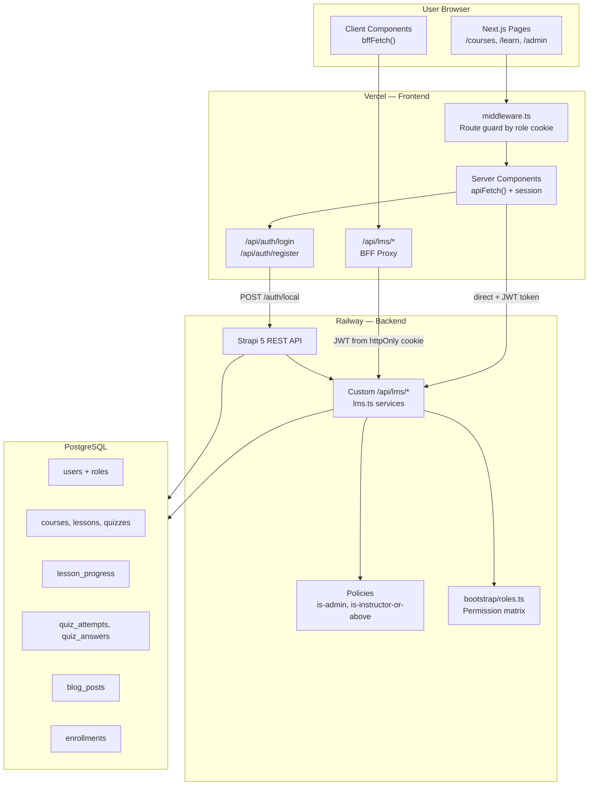
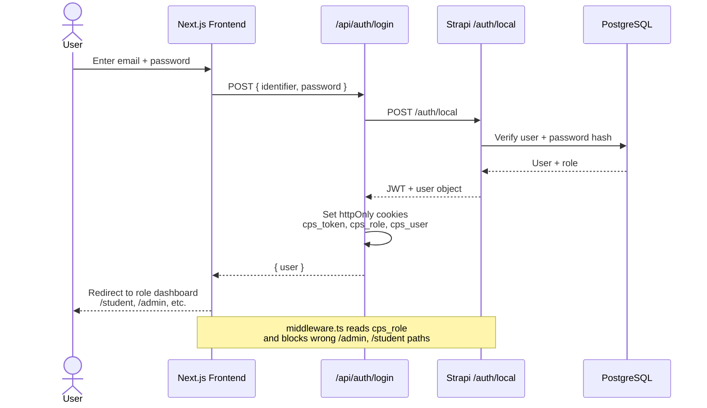
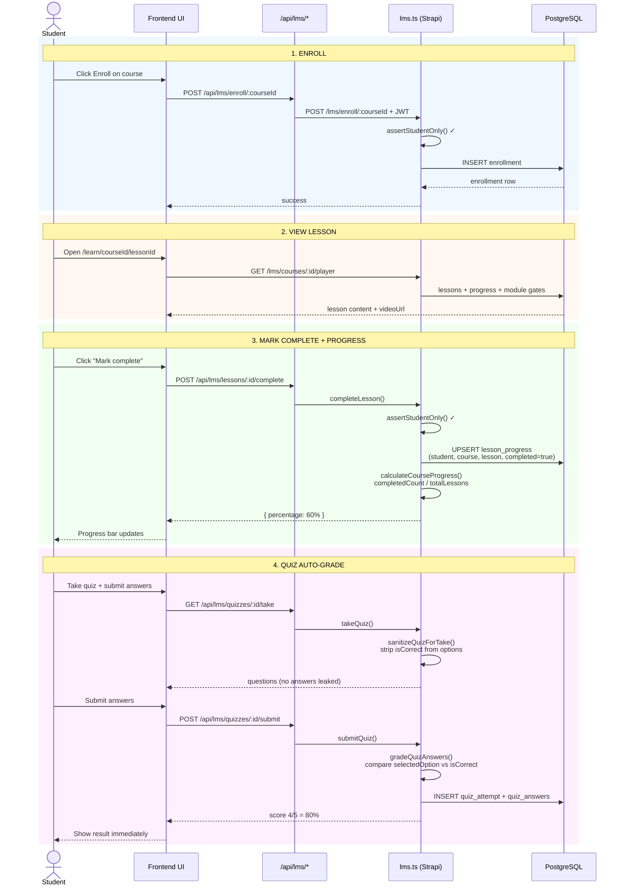
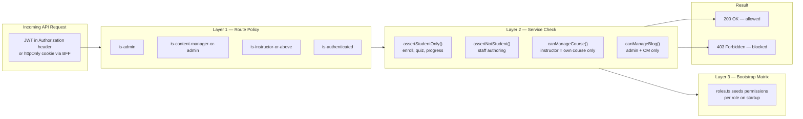
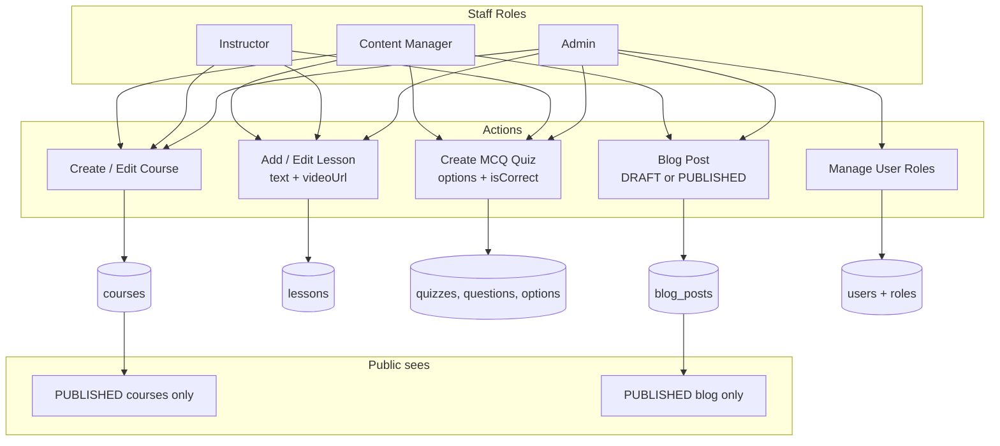
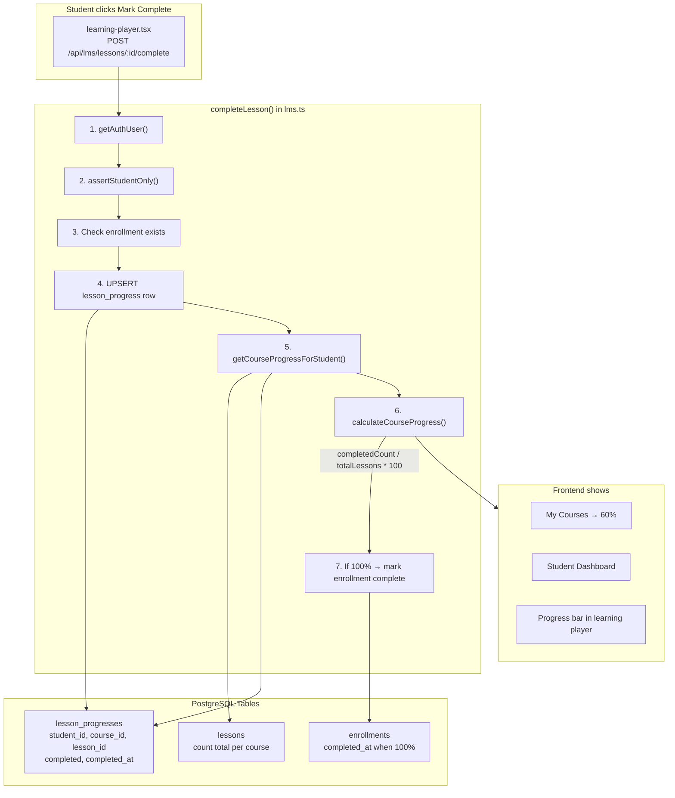
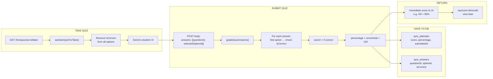
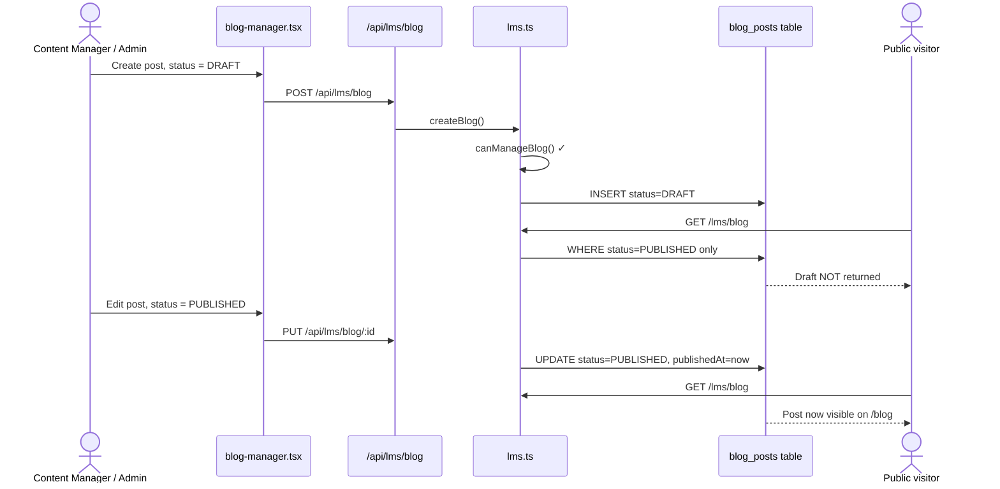
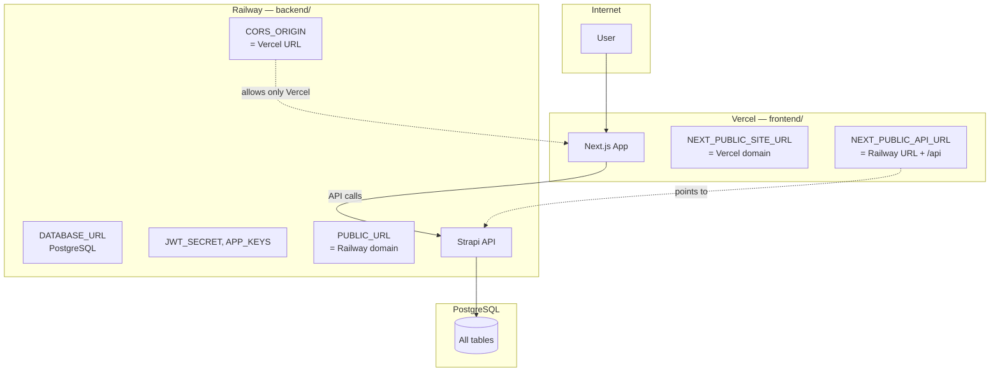

# CPS Academy LMS — Video Walkthrough Diagrams

Use these Mermaid diagrams in your **10-minute video**, README, or slides.  
Preview at [mermaid.live](https://mermaid.live) or in VS Code with a Mermaid extension.

---

## 1. Overall system architecture



**Key files:**
- `frontend/app/api/lms/[...path]/route.ts` — BFF proxy
- `frontend/middleware.ts` — frontend route guard
- `backend/src/api/lms/services/lms.ts` — main API logic
- `backend/src/bootstrap/roles.ts` — role permissions

---

## 2. Login & session data flow



**Key files:**
- `frontend/app/api/auth/login/route.ts`
- `frontend/lib/auth.ts` — `setAuthCookies()`
- `frontend/middleware.ts`

---

## 3. Student flow — enroll → lesson → progress → quiz



**Key files:**
- `frontend/features/courses/enroll-button.tsx`
- `frontend/features/learn/learning-player.tsx`
- `frontend/features/quizzes/quiz-taker.tsx`
- `backend/src/api/lms/services/lms.ts` — `enroll`, `completeLesson`, `submitQuiz`

---

## 4. Role-based access control (RBAC)



**Examples to demo in video:**
| Action | Role | Result |
|--------|------|--------|
| `GET /lms/dashboard/admin` | Student | **403** |
| `POST /lms/enroll/:id` | Instructor | **403** |
| `POST /lms/lessons/:id/complete` | Student | **200** |
| `PUT /lms/admin/users/:id/role` | Admin | **200** |

**Key files:**
- `backend/src/policies/is-admin.ts`
- `backend/src/api/lms/services/lms.ts` — `assertStudentOnly()`
- `backend/src/utils/ownership.ts` — `canManageCourse()`
- `backend/src/bootstrap/roles.ts`

---

## 5. Staff flow — course, lesson, quiz, blog



**Key files:**
- `frontend/features/courses/course-form.tsx`
- `frontend/features/courses/lesson-manager.tsx`
- `frontend/features/courses/quiz-manager.tsx`
- `frontend/features/blog/blog-manager.tsx`
- `frontend/app/admin/users/page.tsx`

---

## 6. Progress tracking — where data is stored



**Formula:**
```
progress % = (completed lessons / total lessons) × 100
```

**Key files (explain line by line in video):**
1. `backend/src/api/lesson-progress/content-types/lesson-progress/schema.json`
2. `backend/src/utils/progress.ts` — `calculateCourseProgress()`
3. `backend/src/api/lms/services/lms.ts` — `getCourseProgressForStudent()`, `completeLesson()`

---

## 7. Quiz auto-grading — data flow



**Key files (explain line by line in video):**
1. `backend/src/utils/quiz.ts` — `sanitizeQuizForTake()`, `gradeQuizAnswers()`
2. `backend/src/api/lms/services/lms.ts` — `takeQuiz()`, `submitQuiz()`
3. `frontend/features/quizzes/quiz-taker.tsx`

---

## 8. Blog draft → publish flow



**Key files:**
- `frontend/features/blog/blog-manager.tsx`
- `backend/src/api/lms/services/lms.ts` — `listBlog()`, `createBlog()`, `manageBlog()`
- `frontend/app/(public)/blog/page.tsx`

---

## 9. Deployment & environment variables



**Env files:**
- `backend/.env.example` — Railway variables
- `frontend/.env.example` — Vercel variables

---

## 10-minute video timeline

| Time | Section | Diagram |
|------|---------|---------|
| 0:00–0:30 | Intro | #1 Architecture |
| 0:30–3:00 | Student live demo | #3 Student flow |
| 3:00–4:30 | CM/Instructor demo | #5 Staff flow |
| 4:30–5:30 | Admin + role change | #4 RBAC |
| 5:30–6:30 | Data flow explanation | #2 or #3 |
| 6:30–7:30 | Backend RBAC code | #4 |
| 7:30–8:30 | Progress logic code | #6 |
| 8:30–9:15 | Quiz grading code | #7 |
| 9:15–9:45 | Blog draft → publish | #8 |
| 9:45–10:00 | Deployment env vars | #9 |

---

## Demo accounts

| Role | Email | Password |
|------|-------|----------|
| Admin | `admin@lms-demo.com` | `DemoAdmin123!` |
| Content Manager | `content@lms-demo.com` | `DemoContent123!` |
| Instructor | `instructor@lms-demo.com` | `DemoInstructor123!` |
| Student | `student@lms-demo.com` | `DemoStudent123!` |

---

## How to preview diagrams

1. Copy any ` ```mermaid ` block into [mermaid.live](https://mermaid.live)
2. Export as PNG/SVG for slides or OBS overlay
3. Or install **Markdown Preview Mermaid Support** in VS Code and open this file
